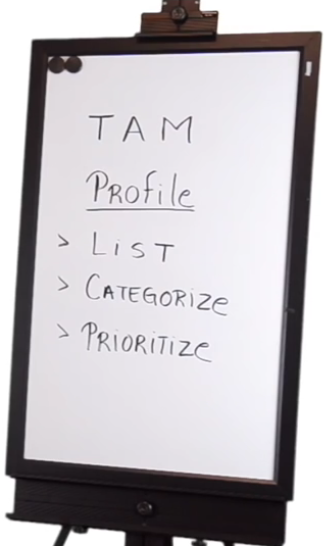

Part III: [How to Sell Your Product or Service - Market Segment & Client Profile](https://www.youtube.com/watch?v=WwbiQG0sUgs)

**TAM**: Total Avaliable Market

显然我们不能面对所有的市场，而是要针对特定市场。如果不Focus，销售就会失败。Focus是销售的关键点。

1. 首先要做的是，有一个Profile
2. 然后创建一个目标市场的列表
   - B2C List: 个人消费者，或者apartment owner
   - B2B List: Commercial
   - Hybrid B2C & B2B List
3. 然后把列表进行分类 
4. 把分类进行优先顺序排列

