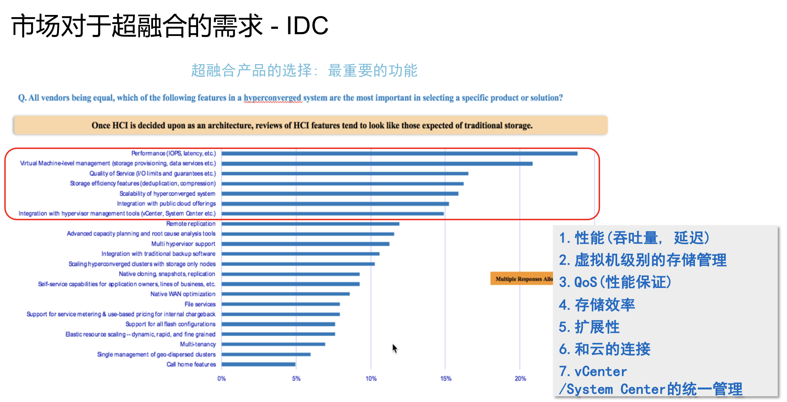
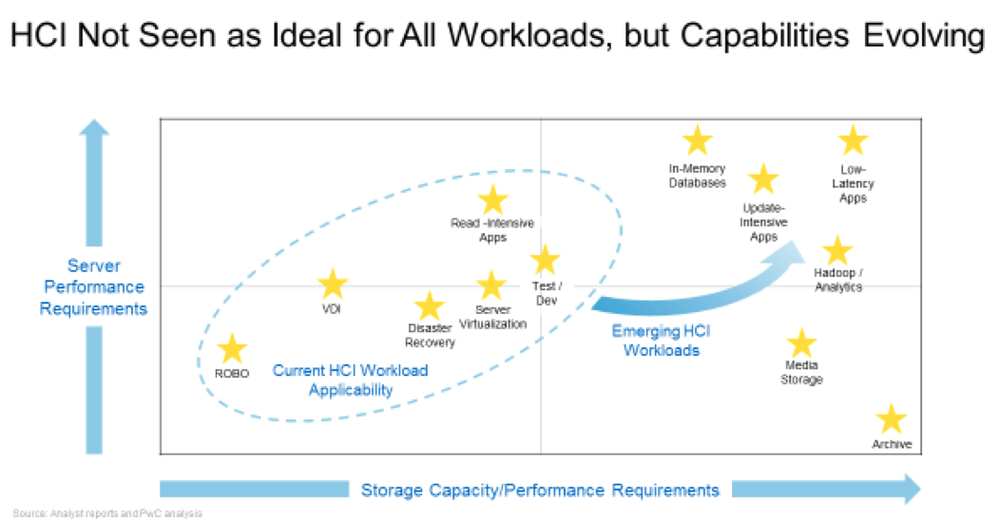

我在前一段时间为了让更多的人了解超融合产品以及NetApp的超融合产品的定位，带来的价值，写了一篇小文。[NetApp超融合 - 给企业级用户的一剂良方](https://mp.weixin.qq.com/s/eejirbZTyI_Fn0WOuDVX9A)。今天我想试着站在用户的视角更加深入的聊一下这个话题。

超融合产品在市场上已经推出了一段时间，企业对它的接受程度也在不断地提高，但是超融合对于企业到底意味着什么，以及现有市场中的超融合产品的定位，恐怕还不是很清楚。这也会影响到用户在挑选超融合产品时，选择多，选型难的问题。

如果我们站在基础架构的管理者角度，看待这个问题。以前需要从不同的厂商采购软件，虚拟化，服务器，网络，存储设备，雇佣不同的专业人员来维护1到多个基础架构，都是至今大部分企业在采用的模式。这种模式我们姑且称为传统模式。采用这种模式时，设备本身的成本之外，人员成本都相对较高，并且，此种模式应对业务的变化很吃力，原因在于当发现资源不够的情况下，想要扩充基础架构中的任何一个层面，都需要去走采购流程，采购，运输，到真正支援到业务，可能从几周到几个月的时间，也就是采购时间的成本比较高。这对于越来越多的业务都无法满足要求。所以，一般的做法是，多购买一些资源，在业务量上来的时候，多余的资源可以提供服务。这样对于业务变化量不大的情况是可以应对的，但是带来了一些问题：

1. 空闲时，大量的资源浪费
2. 业务量增大到一定量的时候，冗余的资源依然无法满足要求，此时依然要碰到上面提到的问题
3. 当出现问题的时候，问题在各个厂商之间推诿，无法快速确定问题根源，解决问题
4. 人员的日常支出，培训等费用高
5. 人员的时间大部分都花在维护基础架构的运行上面，距离业务比较远

下面我们看看超融合的引入，同样是这个管理者，会带来怎样的变化。

首先，之前的架构中的虚拟化，服务器，网络，存储的三层架构都从同一家厂商采购，架构大幅简化。安装，运维变得简单，意味着不再需要雇佣很多的人来做运维，只需要很少的专业人员来维护基础架构。并且，超融合产品大部分都具备横向快速扩展能力，这就在一定程度上解决了传统模式的问题，例如：

1. 单一采购商，发生故障后，由一家厂商来提供支持

2. 快速横向扩展，更好的应对业务量变化

3. 架构的简化带来了运维的简化，需要的专业人员的数量减少

4. 运维人员需要更多的专注在如何用软件定义的方式，更好的为企业的业务提供服务

5. 按需扩展（*），一定程度上的资源的节省

   *：表示存储资源和计算资源无法独立扩展

超融合好处如此之多，是不是超融合就可以完全取代传统架构呢？

我们分两方面来看。

第一，从超融合技术本身来看。

超融合技术的诞生，如果用简单的方式去理解，就是把虚拟化，服务器，网络，存储通过软件定义，分布式存储，压缩到X86服务器的一种技术。这一时期的超融合要解决的问题是，`整合`。这些产品带来的上面的好处的同时，也作出了很多的牺牲。例如，性能上，灵活性上，扩展性上都有各种让步。具体讲，

- 所以在这期间衍生出来的产品，应用类型单一化。大部分是应对虚拟桌面（VDI）。应对核心应用捉襟见肘。
- 由于没有性能保障，无法在一个架构中让多个应用互不干扰的运行，不能做到业务整合。
- 性能无法预测，也意味着和传统架构类似，对于性能部分的预估，只能是摸石头过河。
- 计算和存储的深度融合，带来的就是深度绑定。这样的架构除了带来了扩展性的僵化以外，即要扩大家一起扩，也带来了采购多余的硬件，并且要为多余的CPU内核支付多余的软件许可费用。
- 有些厂商采用的分布式存储，是通过cVM（Controller Virtual Machine）来实现，cVM自身会占用大量的内存和CPU，有的超过33%。也就意味着，客户的费用有33%是没有利用到业务上，而是让这个系统正常运行起来的费用。换句话说，好钢没有用到刀刃上。

读到这里，不难看出，这一时期的大部分产品都是过渡型产品。

第二，从现有以及未来的1-3年，企业对于超融合的需求来看。

随着企业对超融合的接受度的提升，出现了两种变化。首先，企业对于超融合的要求发生了变化。我们看看IDC对这一点的分析。

可以看出，市场对于超融合的需求点，要求的前7项当中，过渡型产品能满足其中的一小部分，但是其中的大部分，例如2，3，4，5，6，都是难以满足的。

其次，企业想把更多的业务放到超融合设备上，甚至开始考虑把一些原本超融合不擅长的业务也放到上面去。例如，低延迟应用，Hadoop分析等。这就对现有的超融合产品提出了一个严峻的挑战，而上面提到的过渡型超融合的短板开始凸显。

此时市场需要的不是一款过渡型产品，而是一个新型的，颠覆型的，能够满足现有以及未来的业务需求的超融合产品。而NetApp的HCI恰恰是在这样的一个时间点上，应运而生。很好的抓住了市场的需求，在合适的时机切入了这个市场。

我们看看NetApp的超融合是如何解决现有超融合所面临的问题，以及如何更好地适应未来的企业需求的。

- 性能
  - 可预测：每个节点的IOPS是固定的，这样可以很好地按照模块化的方式，根据业务量来购买和扩展节点
  - 有保障：通过**业界独有**的性能保障技术，可以让每个应用拥有最大，最小，峰值的三个性能阈值。让应用各行其道，保证自己的服务级别。由于有了这个技术，可以让HCI真正做到多个业务的整合。
  - 全闪：高性能，低延迟。对核心应用提供更好地支撑
- 简单性：
  - 通过一个部署工具，一次性快速部署超融合（最短30分钟）
  - 扩展通过简单的命令即可完成
- 灵活性
  - 计算资源和存储资源可以单独扩展，真正的按需购买。没有隐含的收费，额外的硬件支出成本，软件许可费用
  - 可以和现有基础架构，FAS等配合使用，充分利用现有投资
  - 更低的总体拥有成本
- 和云的对接
  - 可以通过CloudBackup把数据备份到公有云
  - 可以和NetApp的对象存储做整合，为多种数据类型提供不同的选择

此外，还有很多独有的功能，例如vNAS，在HCI一套设备上提供SAN和NAS的访问，通过VVOL（虚拟卷）实现虚拟机级别的存储管理，存储的开放性，等等。

不难看出，NetApp的HCI是厚积薄发，充分考虑了市场的需求，考虑了未来发展而设计的一款企业级产品。而不是为了打入市场，推出的过渡型产品。同时，也围绕它打造了一个整体的解决方案。无论客户的业务，数据在哪里，数据的类型是结构化，非结构化的都可以为其量身定制一套最优的方案。

如果您的企业在更新服务器，更新存储，或者考虑搭建新的数据中心，不妨多了解一下NetApp的HCI。相信NetApp的团队，我们的合作伙伴，会为您提供满意的服务。

欲了解关于NetApp 超融合的更多信息，请访问[NetApp HCI中文官网](https://www.netapp.com/cn/products/converged-systems/hyper-converged-infrastructure.aspx)

联系作者：

